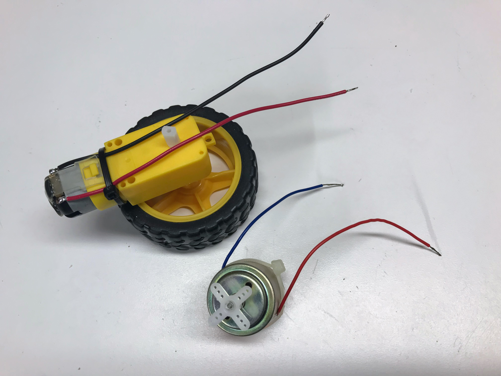

# Lesson Using 6-Volt DC Hobby Motors



## Sample Prompt

```linenums="0"
Create a lesson plan using two 6-volt DC hobby
motors with wheels for a 5th grade
classroom that is interested in building robots.
Assume you have a battery pack of 3 AA batteries,
wires, and a glue gun.
```
## Sample Response

### Lesson Plan: Building a Simple Robot with DC Motors

#### Objective:

Students will learn about basic electronics and robotics by building a simple robot using DC motors and a battery pack.

#### Materials:

-  2 DC motors (as shown in the image)
-  1 battery pack for 3 AA batteries
-  3 AA batteries
-  2 wheels (one attached to each motor)
-  Chassis (can be a small plastic container or cardboard)
-  Electrical tape and/or heat shrink tubing
-  Small switch (optional)
-  Connecting wires
-  Hot glue gun and glue sticks
-  Screwdriver
-  Scissors or wire cutters

Duration: About 2 hours

#### Lesson Steps:

**1\. Introduction to DC Motors and Robotics (15 minutes)**

-   Explain what a DC motor is and how it works.
-   Discuss how robots use motors to move.
-   Show examples of simple robots (videos or images).

**2\. Safety Briefing (5 minutes)**

-   Explain the importance of safety when working with batteries and hot glue.
-   Demonstrate how to safely use the hot glue gun.

**3\. Building the Robot (90 minutes)**

#### Step 1: Prepare the Motors

-  Attach a wheel to each motor securely.
-  Connect wires to the motor terminals if not already connected. Red wire to one terminal and black (or blue) to the other.

#### Step 2: Construct the Chassis

-   Use a small plastic container or piece of cardboard as the base.
-   Attach the motors to the bottom of the chassis using hot glue, making sure the wheels can rotate freely.

#### Step 3: Connect the Motors to the Battery Pack

-   Attach the battery pack to the top of the chassis using hot glue or tape.
-   Connect the red wire from each motor to the red wire from the battery pack.
-   Connect the black wire from each motor to the black wire from the battery pack.
-   Optionally, include a switch between the battery pack and the motors to turn the robot on and off.

#### Step 4: Test the Robot

-   Insert the AA batteries into the battery pack.
-   Turn on the switch (if included) and observe the robot move.
-   If the robot doesn't move, check the connections and ensure the batteries are inserted correctly.

#### Step 5: Customize the Robot

-   Allow students to decorate their robots with markers, stickers, or other craft supplies.
-   Encourage students to experiment with different chassis designs and motor placements.

#### Wrap-Up and Discussion (10 minutes)**

-   Ask students to share their experiences building the robot.
-   Discuss what they learned about motors and robotics.
-   Talk about potential improvements and modifications they could make to their robots.

**5\. Clean-Up (10 minutes)**

-   Ensure all materials are put away properly.
-   Make sure the classroom is tidy and free of any hazards.

#### Additional Resources:

- Provide links to simple robotics projects and tutorials.
- Suggest books or websites for further reading on robotics and electronics.

#### Assessment:

- Observe students during the activity to ensure they are following instructions and working safely.
- Assess the functionality of each student's robot.
- Encourage students to explain how their robot works and what they learned from the activity.

This lesson plan aims to provide a hands-on, engaging introduction to robotics and electronics, suitable for 5th-grade students.